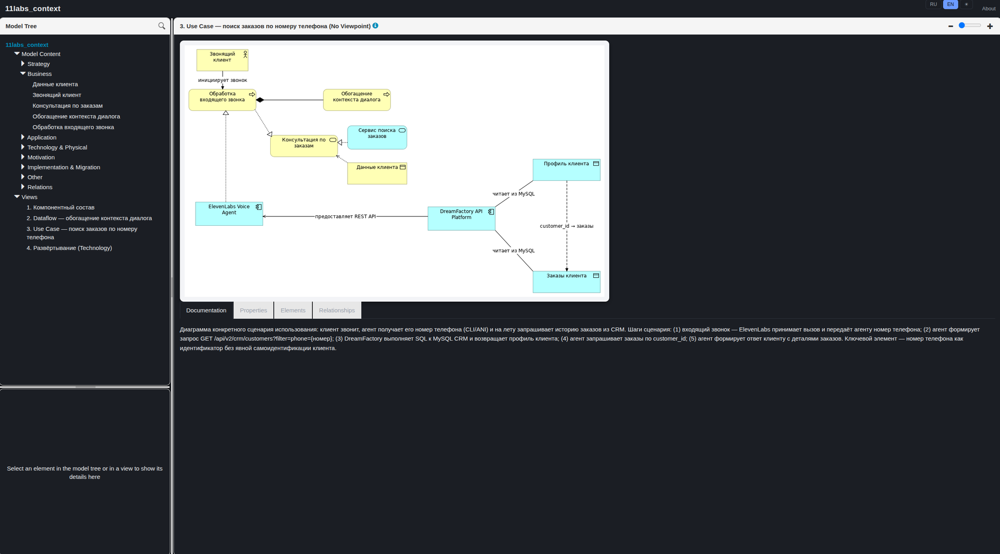

<p align="center">
  
</p>

<p align="center">
  <b>One <code>docker run</code> turns a git-hosted ArchiMate model into a live,<br>
  auto-updating HTML report with an RU/EN + light/dark theme.</b>
</p>

<p align="center">
  🥧 <b>Killer feature: Archi finally runs on a Raspberry Pi.</b><br>
  There's no official Linux ARM64 build of Archi — we build one <b>natively
  from source</b>, no box64/QEMU at runtime.
</p>

<p align="center">
  <a href="https://github.com/umka-beaf/archimate-report/actions/workflows/docker-publish.yml"></a>
  <a href="https://hub.docker.com/r/umkabeaf/archimate-report"></a>
  <a href="https://hub.docker.com/r/umkabeaf/archimate-report"></a>
  <a href="https://github.com/umka-beaf/archimate-report/pkgs/container/archimate-report"></a>
  
  <a href="LICENSE"></a>
</p>

<p align="center">🇬🇧 English · 🇷🇺 <a href="README.ru.md">Русский</a></p>

<p align="center">
  
</p>

---

A Docker image that clones a git repository containing an ArchiMate model
(a single `*.archimate` file **or** a [coArchi](https://www.archimatetool.com/plugins/)
repository, format auto-detected), runs it through the official
[Archi CLI](https://github.com/archimatetool/archi/wiki/Archi-Command-Line-Interface)
to generate an HTML report, and serves it as static files via
[Caddy](https://caddyserver.com/). Accepts a webhook from GitHub/GitLab/anything
generic to regenerate the report on push.

This README is the project's common entry point: it covers the core contract
(env vars, webhook, volumes, compose) and gets you to a running service.
Deeper topics live in their own docs (each also available in Russian, with a
`.ru.md` suffix):

| Doc | What's in it |
|---|---|
| 🐳 [docs/CADDY.md](docs/CADDY.md) | The single public-facing process: serving the report + reverse proxy to the webhook, TLS termination left to you, how report publishing works |
| 🎨 [docs/THEMING.md](docs/THEMING.md) | The RU/EN + light/dark report theme (`USE_MODERN_CSS`): how it works, how to customize it |
| 🪝 [docs/WEBHOOK.md](docs/WEBHOOK.md) | The `archi-webhook` Go listener: the three signature-verification schemes, the single-slot debounce, the `/status` shape |
| 🧩 [docs/PATCHES.md](docs/PATCHES.md) | The additive patch behind the native arm64 Archi source build — why it exists and how it's wired into `docker/Dockerfile` |
| 🗂️ [docs/MULTI_MODEL.md](docs/MULTI_MODEL.md) | Serving several models from one instance (`MODEL_<N>_*`): configuration, paths, the generation queue |
| 🔒 [docs/SECURITY.md](docs/SECURITY.md) | The service doesn't authenticate on its own — recommended forward-auth-by-path pattern, how not to break the webhook |
| 📋 [docs/LOGGING.md](docs/LOGGING.md) | `LOG_LEVEL`: what each level means, which component logs what, how it's implemented across the shell scripts and the Go webhook |
| 🏷️ [docs/VERSIONING.md](docs/VERSIONING.md) | What the two numbers in the image tag mean (Archi version vs. project version), which tag to pin, see also `CHANGELOG.md` |
| 🐋 [docs/DOCKERHUB.md](docs/DOCKERHUB.md) | The short version of this README, used for the Docker Hub image page |

**Multiple models from one instance.** Besides a single model via `GIT_URL`,
the service can serve several ArchiMate reports from one container — each
under its own `/<slug>/` path, configured via indexed `MODEL_<N>_*`
variables. Details, including recommendations for external path-based
authentication, are in [docs/MULTI_MODEL.md](docs/MULTI_MODEL.md) and
[docs/SECURITY.md](docs/SECURITY.md).

### ✨ Why this might be useful

- **🥧 Archi on a Raspberry Pi — finally.** There's no official Linux ARM64
  build of Archi, and emulating the x86_64 build via box64 runs into an open
  upstream bug (JVM/SWT/GTK3 — hangs or SIGBUSes) — so we build Archi
  **natively from source** for `linux/gtk/aarch64` (Tycho/Maven) right at
  `docker buildx build` time. No QEMU/box64 at runtime — on a Pi 5, the
  report is generated on native silicon, byte-identical to the amd64 output.
  Details in [docs/PATCHES.md](docs/PATCHES.md).
- **Model format is auto-detected.** A single `.archimate` file or a coArchi
  repository (the git-native model format, one file per element) — no manual
  configuration needed in the common case.
- **RU/EN + light/dark report theme out of the box** (`USE_MODERN_CSS`, on by
  default) — language/theme toggle right in the report, better panel
  proportions. Prefer stock Archi styling? One flag turns it all off.
- **📝 Element documentation renders as Markdown, not raw text.** Archi's
  stock report just prints the Documentation field's contents as-is — even
  if you wrote lists/tables/code in there. Here it goes through a real
  Markdown renderer right in the browser, so your model's documentation
  finally looks like documentation instead of a wall of text. Details in
  [docs/THEMING.md](docs/THEMING.md).

<p align="center">
  
</p>

- **Debounced webhook.** `github`/`gitlab`/`generic` signature schemes, a
  single-slot queue — concurrent pushes never race two generations against
  each other.
- **Validated before publishing.** The report is generated into a scratch
  directory and checked (non-empty `index.html`, see
  [archi#980](https://github.com/archimatetool/archi/issues/980)) — only
  then does its content replace what Caddy serves. That swap isn't a single
  atomic `rename(2)` (that breaks the moment `/data/report` is a mounted
  volume — see "Volumes" below), just a fast sequence of `mv`s, so in theory
  there's a vanishingly short window of mixed old/new content — not an issue
  in practice since the report is regenerated wholesale on every run anyway.
- **No surprises at startup.** Healthcheck, git operation timeouts/retries,
  and clear fail-fast configuration errors instead of a silently broken
  service.

### 🚀 Quick start

```bash
docker run -d \
  --name archimate-report \
  -p 3000:3000 \
  -e GIT_URL=https://github.com/your-org/your-model-repo.git \
  -e GIT_TOKEN=ghp_xxx \
  umkabeaf/archimate-report:latest
```

The same image is mirrored to GHCR —
`ghcr.io/umka-beaf/archimate-report` (tags always match Docker Hub, see
"Building and publishing the image" below); substitute that address for
`umkabeaf/archimate-report:latest` if you'd rather pull from ghcr.io.

The report is available at `http://localhost:3000` a few seconds after start
(the first generation runs synchronously before the web server comes up).

### Environment variables

| Variable | Required | Description |
|---|---|---|
| `GIT_URL` | yes | Repository URL (`https://` or `git@...`) |
| `GIT_REF` | no | branch/tag/commit, defaults to the default branch's HEAD |
| `MODEL_PATH` | no | path to the `.archimate` file or coArchi repo root, if auto-detection is ambiguous |
| `MODEL_FORMAT` | no | `auto` (default) / `plain` / `coarchi` |
| `GIT_TOKEN` | no* | HTTPS token (PAT) |
| `GIT_USERNAME` / `GIT_PASSWORD` | no* | login+password for HTTPS |
| `GIT_SSH_PRIVATE_KEY` | no* | private SSH key (PEM or base64) ⚠️ not tested end-to-end yet |
| `GIT_SSH_KNOWN_HOSTS` | no | known_hosts content; without it — TOFU (`accept-new`) |
| `WEBHOOK_SECRET` | no | if set, enables `/webhook` |
| `WEBHOOK_PROVIDER` | no** | `github` / `gitlab` / `generic` — required if `WEBHOOK_SECRET` is set |
| `WEBHOOK_PATH` | no | endpoint path, defaults to `/webhook` |
| `PORT` | no | serving port, defaults to `3000` |
| `REGENERATE_ON_START` | no | `true` (default) / `false` |
| `GENERATION_TIMEOUT` | no | timeout for a single generation run, seconds (default `600`) |
| `USE_MODERN_CSS` | no | `true` (default) / `false` — RU/EN + light/dark report theme layered on Archi's stock look |
| `LOG_LEVEL` | no | `DEBUG` / `INFO` (default) / `WARNING` / `ERROR` — verbosity of `entrypoint`/`generate`/`archi-webhook` log lines, see [docs/LOGGING.md](docs/LOGGING.md) |
| `TZ` | no | container timezone |

`*` — exactly one git auth method (or none, for public repositories).
`**` — required only together with `WEBHOOK_SECRET`.

`GET /status` (same port as the report) returns JSON
`{generating, last_run_at, last_success, last_error}` — used as the container
healthcheck.

### Webhook

Without `WEBHOOK_SECRET`, the `/webhook` endpoint isn't registered at all
(returns 404) — a safe default, nothing is enabled implicitly. If
`WEBHOOK_SECRET` is set, `WEBHOOK_PROVIDER` is required — the container fails
at startup with a clear error if it's missing or invalid.

| `WEBHOOK_PROVIDER` | Verification | Header/parameter |
|---|---|---|
| `github` | HMAC-SHA256 of the request body, keyed with `WEBHOOK_SECRET` | `X-Hub-Signature-256: sha256=<hex>` |
| `gitlab` | Direct constant-time comparison with `WEBHOOK_SECRET` | `X-Gitlab-Token: <secret>` |
| `generic` | Direct constant-time comparison with `WEBHOOK_SECRET` | `X-Webhook-Secret: <secret>` header or `?secret=<secret>` query param |

The endpoint path is configurable via `WEBHOOK_PATH` (default `/webhook`). A
successful request immediately returns `202 Accepted` — generation runs
asynchronously. Check progress/result via `GET /status`. A single-slot
debounce queue means concurrent pushes never race two `git clone`/Archi CLI
runs against each other.

### Volumes

Three working directories; none are declared as `VOLUME` in the image —
without explicit mounting they're ordinary container layers that don't
survive `docker rm`:

| Path | Purpose | Mount it? |
|---|---|---|
| `/data/report` | Finished HTML report, served by Caddy | Yes, if you want the report to survive container recreation — especially with `REGENERATE_ON_START=false` |
| `/data/repo` | Working copy of the model's git repository | Optional — speeds up subsequent runs (`git fetch` instead of a full `clone`) |
| `/data/secrets` | Temporary auth material, `600` perms | No — recreated from env vars on every run |

For a full `docker-compose.yml` example (YAML anchors, an external
reverse-proxy network, etc.), see the [Russian README](README.ru.md#docker-compose)
— it hasn't been translated separately, but the compose file itself is
language-neutral.

### 🏗️ Architectures

- `linux/amd64` — official Archi build (`Archi-Linux64-*.tgz`).
- `linux/arm64` — Archi built natively from source (Tycho/Maven,
  `linux/gtk/aarch64`) at image build time. No official Linux ARM64 build of
  Archi exists — the Eclipse p2 repository already ships the needed SWT/GTK
  fragments, upstream just never requested that target. The additive patch
  lives in `docker/patches/`.

### ✅ Pre-release checks (`docker/scripts/smoke-test.sh`)

Since CI doesn't rebuild the image on every commit (see below), run
`docker/scripts/smoke-test.sh` before a manual release. It builds the image for the
**host platform only** (a multi-arch manifest can't be produced with
`--load`) and runs regression checks against the logic shared by both
architectures: `generate.sh`, `entrypoint.sh`, the Caddyfile, the webhook.

It checks: the plain model format (explicit `MODEL_PATH`) and the coArchi
format with auto-detection — in both cases the container comes up, `GET
/status` returns valid JSON, the report is served over HTTP 200 and isn't
empty; plus a real webhook round-trip (correct secret → `202` → wait for the
regeneration to finish; wrong secret → `401`).

```bash
./docker/scripts/smoke-test.sh                       # build + test, ARCHI_VERSION=latest
ARCHI_VERSION=5.9.0 ./docker/scripts/smoke-test.sh    # pin a version
SKIP_BUILD=1 IMAGE=archi-report:m5 ./docker/scripts/smoke-test.sh   # reuse an already-built image
```

Containers it starts only live for the duration of the run — cleaned up
automatically (`trap cleanup EXIT`) regardless of outcome. Exit 0 means it's
safe to move on to the real multi-arch build and `--push`; a non-zero exit
means read the log above the failing check and don't publish the image.

### 📦 Building and publishing the image

No CI auto-builds on every commit — publishing is manual, triggered by a new
Archi release:

```bash
docker buildx build \
  -f docker/Dockerfile \
  --platform linux/amd64,linux/arm64 \
  -t <your-dockerhub-namespace>/archimate-report:<ARCHI_VERSION> \
  -t <your-dockerhub-namespace>/archimate-report:latest \
  --push .
```

(`umkabeaf/archimate-report` earlier in this README is *our* published image —
pull that as-is. `<your-dockerhub-namespace>` here is only for forks
publishing their own copy; substitute your own Docker Hub username/org.)

Run from the repo root (not `docker/`) — the build context is deliberately
the whole repo so the `Dockerfile` can pull favicons straight from
`assets/favicon/` instead of keeping a second, hand-synced copy under
`docker/`.

`ARCHI_VERSION` can be pinned explicitly via `--build-arg
ARCHI_VERSION=5.9.0`; it defaults to resolving `latest` via the GitHub
Releases API at build time.

The same multi-arch build+push can also be run manually from GitHub Actions
— see `.github/workflows/docker-publish.yml` (`workflow_dispatch`, no
auto-trigger on every push). CI splits the build into separate jobs —
`linux/amd64` builds on a regular runner, `linux/arm64` on a native
`ubuntu-24.04-arm` runner (no QEMU emulation, much faster than emulating the
Tycho/Maven build under an amd64 runner) — then a merge job assembles both
digests into one manifest list and publishes it to both Docker Hub and, as a
mirror, GHCR (`ghcr.io/umka-beaf/archimate-report`) with tags identical to
Docker Hub, via `docker buildx imagetools create`, with no rebuild.

The same `workflow_dispatch` run (as long as `push` isn't explicitly disabled)
also publishes `docs/DOCKERHUB.md` as the repository's long description on the
Docker Hub page — no separate step needed, it reuses the same
`DOCKERHUB_USERNAME`/`DOCKERHUB_TOKEN` secrets as the registry login. The same
script (`docker/scripts/publish-dockerhub-readme.sh`) can also be run manually,
locally, if you only need to update the description without rebuilding the
image:

```bash
DOCKERHUB_USERNAME=your-dockerhub-user DOCKERHUB_TOKEN=dckr_pat_xxx \
  ./docker/scripts/publish-dockerhub-readme.sh
```

### 📄 License

[MIT](LICENSE). The image itself bundles [Archi](https://www.archimatetool.com/)
(Eclipse Public License 2.0) and the [coArchi](https://www.archimatetool.com/plugins/)
plugin (archimatetool.com's own license) — downloaded/built at `docker build`
time, not distributed as part of this repository's source.
