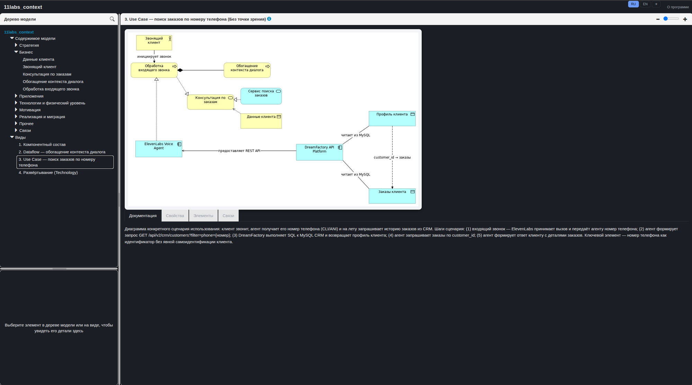
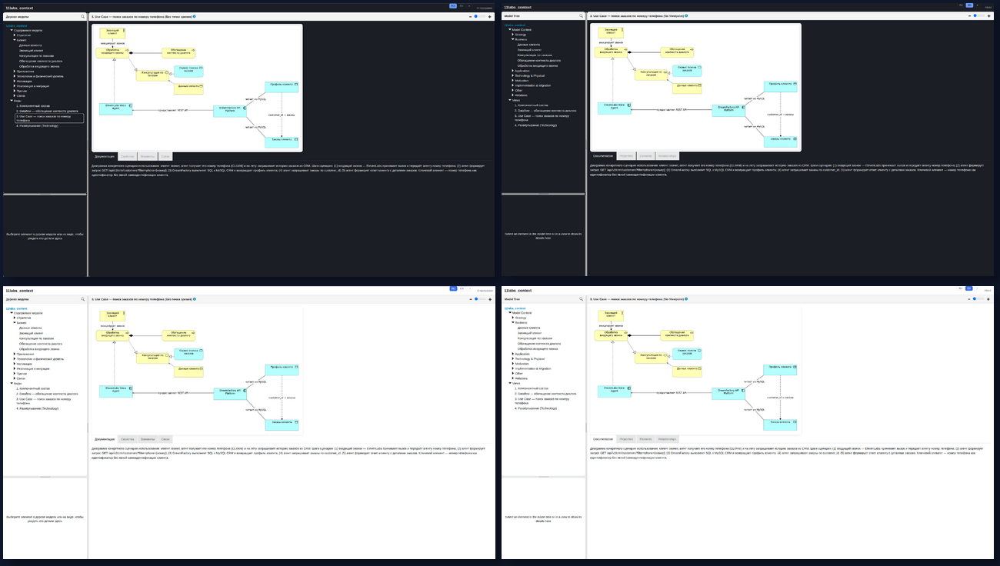

<p align="center">
  
</p>

<p align="center">
  <b>Один <code>docker run</code> — и ваша ArchiMate-модель из git превращается в живой,<br>
  автообновляемый HTML-отчёт с RU/EN и light/dark темой.</b>
</p>

<p align="center">
  🥧 <b>Killer-фича: Archi наконец-то работает на Raspberry Pi.</b><br>
  Официальной Linux ARM64-сборки Archi не существует — мы собираем её
  <b>нативно из исходников</b>, без box64/QEMU в рантайме.
</p>

<p align="center">
  <a href="https://hub.docker.com/r/umkabeaf/archimate-report"></a>
  <a href="https://hub.docker.com/r/umkabeaf/archimate-report"></a>
  <a href="https://github.com/umka-beaf/archimate-report/pkgs/container/archimate-report"></a>
  
  <a href="LICENSE"></a>
</p>

<p align="center">🇷🇺 Русский · 🇬🇧 <a href="README.md">English</a></p>

<p align="center">
  
</p>

---

Docker-образ, который клонирует git-репозиторий с ArchiMate-моделью
(одиночный `*.archimate`-файл **или** [coArchi](https://www.archimatetool.com/plugins/)-репозиторий,
формат определяется автоматически), прогоняет её через официальный
[Archi CLI](https://github.com/archimatetool/archi/wiki/Archi-Command-Line-Interface)
и генерирует HTML-отчёт, раздавая его статикой через
[Caddy](https://caddyserver.com/). Принимает вебхук от GitHub/GitLab/чего
угодно generic, чтобы перегенерировать отчёт по пушу.

Этот README — общая точка входа проекта: он покрывает базовый контракт
(env-переменные, вебхук, тома, compose) и доводит до работающего сервиса.
Более глубокие темы вынесены в отдельные доки (у каждой есть и английская
версия — без суффикса `.ru`):

| Документ | Что внутри |
|---|---|
| 🐳 [docs/CADDY.ru.md](docs/CADDY.ru.md) | Единственный публичный процесс: раздача отчёта + reverse proxy на вебхук, TLS-терминация оставлена вам, как устроена публикация отчёта |
| 🎨 [docs/THEMING.ru.md](docs/THEMING.ru.md) | RU/EN + light/dark тема отчёта (`USE_MODERN_CSS`): как это работает, как кастомизировать |
| 🪝 [docs/WEBHOOK.ru.md](docs/WEBHOOK.ru.md) | Go-листенер `archi-webhook`: три схемы проверки подписи, однослотовый дебаунс, формат `/status` |
| 🧩 [docs/PATCHES.ru.md](docs/PATCHES.ru.md) | Аддитивный патч, на котором держится нативная сборка Archi под arm64 — зачем он нужен и как встроен в `docker/Dockerfile` |
| 🗂️ [docs/MULTI_MODEL.ru.md](docs/MULTI_MODEL.ru.md) | Раздача нескольких моделей с одного инстанса (`MODEL_<N>_*`): конфигурация, пути, очередь генерации |
| 🔒 [docs/SECURITY.ru.md](docs/SECURITY.ru.md) | Сервис сам не аутентифицирует — рекомендованная схема forward-auth по path, как не сломать вебхук |
| 📋 [docs/LOGGING.ru.md](docs/LOGGING.ru.md) | `LOG_LEVEL`: что означает каждый уровень, какой компонент что логирует, как это реализовано в shell-скриптах и Go-вебхуке |
| 🏷️ [docs/VERSIONING.ru.md](docs/VERSIONING.ru.md) | Что означают два числа в теге образа (версия Archi vs. версия проекта), какой тег пиннить, см. также `CHANGELOG.md` |
| 🐋 [docs/DOCKERHUB.md](docs/DOCKERHUB.md) | Короткая версия этого README, используется для страницы образа на Docker Hub |

**Несколько моделей в одном инстансе.** Помимо одиночной модели через
`GIT_URL`, сервис может раздавать сразу несколько ArchiMate-отчётов из
одного контейнера — каждый под своим путём `/<slug>/`, конфигурируется
через индексированные переменные `MODEL_<N>_*`. Подробности, включая
рекомендации по внешней path-based аутентификации, — в
[docs/MULTI_MODEL.ru.md](docs/MULTI_MODEL.ru.md) и
[docs/SECURITY.ru.md](docs/SECURITY.ru.md).

### ✨ Почему это может быть полезно

- **🥧 Archi на Raspberry Pi — наконец-то.** Официальной Linux ARM64-сборки
  Archi нет, а эмуляция x86_64-сборки через box64 упирается в открытый
  upstream-баг (JVM/SWT/GTK3 — зависание или SIGBUS) — поэтому мы собираем
  Archi **нативно из исходников** под `linux/gtk/aarch64` (Tycho/Maven) прямо
  во время `docker buildx build`. Никакого QEMU/box64 в рантайме — на Pi 5
  отчёт генерируется на нативном железе, побайтово идентичном amd64-выводу.
  Подробности в [docs/PATCHES.ru.md](docs/PATCHES.ru.md).
- **Формат модели определяется автоматически.** Одиночный `.archimate`-файл
  или coArchi-репозиторий (git-нативный формат модели, по файлу на элемент)
  — в типичном случае ручная настройка не нужна.
- **RU/EN + light/dark тема отчёта из коробки** (`USE_MODERN_CSS`, включена
  по умолчанию) — переключатель языка/темы прямо в отчёте, более сбалансированные
  пропорции панелей. Предпочитаете штатный вид Archi? Один флаг всё отключает.
- **📝 Документация элементов рендерится как Markdown, а не сырой текст.**
  Штатный отчёт Archi просто печатает содержимое поля Documentation как есть
  — даже если вы писали туда списки/таблицы/код. Здесь это проходит через
  настоящий Markdown-рендерер прямо в браузере, так что документация вашей
  модели наконец выглядит как документация, а не стена текста. Подробности
  в [docs/THEMING.ru.md](docs/THEMING.ru.md).

<p align="center">
  
</p>

- **Дебаунс вебхука.** Схемы подписи `github`/`gitlab`/`generic`,
  однослотовая очередь — параллельные пуши никогда не запускают две
  генерации друг против друга.
- **Валидация перед публикацией.** Отчёт генерируется во временную
  директорию и проверяется (непустой `index.html`, см.
  [archi#980](https://github.com/archimatetool/archi/issues/980)) — только
  после этого его содержимое заменяет то, что раздаёт Caddy. Эта подмена —
  не единый атомарный `rename(2)` (он ломается, как только `/data/report` —
  смонтированный том, см. «Тома» ниже), а просто быстрая последовательность
  `mv`, так что теоретически есть исчезающе короткое окно смешанного
  старого/нового контента — на практике не проблема, т.к. отчёт всё равно
  перегенерируется целиком при каждом прогоне.
- **Никаких сюрпризов при старте.** Healthcheck, таймауты/ретраи
  git-операций и понятные fail-fast ошибки конфигурации вместо тихо
  сломанного сервиса.

### 🚀 Быстрый старт

```bash
docker run -d \
  --name archimate-report \
  -p 3000:3000 \
  -e GIT_URL=https://github.com/your-org/your-model-repo.git \
  -e GIT_TOKEN=ghp_xxx \
  umkabeaf/archimate-report:latest
```

Тот же образ зеркалируется в GHCR —
`ghcr.io/umka-beaf/archimate-report` (теги всегда совпадают с Docker Hub, см.
«Сборка и публикация образа» ниже); подставьте этот адрес вместо
`umkabeaf/archimate-report:latest`, если хотите тянуть с ghcr.io.

Отчёт будет доступен на `http://localhost:3000` через несколько секунд
после старта (первая генерация выполняется синхронно, до поднятия
веб-сервера).

### Переменные окружения

| Переменная | Обязательна | Описание |
|---|---|---|
| `GIT_URL` | да | URL репозитория (`https://` или `git@...`) |
| `GIT_REF` | нет | ветка/тег/коммит, по умолчанию — HEAD дефолтной ветки |
| `MODEL_PATH` | нет | путь к `.archimate`-файлу или корню coArchi-репозитория, если автоопределение неоднозначно |
| `MODEL_FORMAT` | нет | `auto` (по умолчанию) / `plain` / `coarchi` |
| `GIT_TOKEN` | нет* | HTTPS-токен (PAT) |
| `GIT_USERNAME` / `GIT_PASSWORD` | нет* | логин+пароль для HTTPS |
| `GIT_SSH_PRIVATE_KEY` | нет* | приватный SSH-ключ (PEM или base64) ⚠️ ещё не протестирован end-to-end |
| `GIT_SSH_KNOWN_HOSTS` | нет | содержимое known_hosts; если не задано — TOFU (`accept-new`) |
| `WEBHOOK_SECRET` | нет | если задан — включает `/webhook` |
| `WEBHOOK_PROVIDER` | нет** | `github` / `gitlab` / `generic` — обязателен, если задан `WEBHOOK_SECRET` |
| `WEBHOOK_PATH` | нет | путь эндпоинта, по умолчанию `/webhook` |
| `PORT` | нет | порт раздачи, по умолчанию `3000` |
| `REGENERATE_ON_START` | нет | `true` (по умолчанию) / `false` |
| `GENERATION_TIMEOUT` | нет | таймаут на один прогон генерации, сек (по умолчанию `600`) |
| `USE_MODERN_CSS` | нет | `true` (по умолчанию) / `false` — RU/EN + light/dark тема отчёта поверх штатного вида Archi |
| `LOG_LEVEL` | нет | `DEBUG` / `INFO` (по умолчанию) / `WARNING` / `ERROR` — уровень детализации логов `entrypoint`/`generate`/`archi-webhook`, см. [docs/LOGGING.ru.md](docs/LOGGING.ru.md) |
| `TZ` | нет | таймзона контейнера |

`*` — должен быть задан ровно один способ git-авторизации (или ни одного,
для публичных репозиториев).
`**` — обязательна только вместе с `WEBHOOK_SECRET`.

`GET /status` (тот же порт, что и отчёт) возвращает JSON
`{generating, last_run_at, last_success, last_error}` — используется как
healthcheck контейнера.

### Вебхук

Без `WEBHOOK_SECRET` эндпоинт `/webhook` вообще не регистрируется
(возвращает 404) — безопасный дефолт, ничего не включается неявно. Если
`WEBHOOK_SECRET` задан, `WEBHOOK_PROVIDER` обязателен — контейнер падает при
старте с понятной ошибкой, если он отсутствует или невалиден.

| `WEBHOOK_PROVIDER` | Проверка | Заголовок/параметр |
|---|---|---|
| `github` | HMAC-SHA256 тела запроса на ключе `WEBHOOK_SECRET` | `X-Hub-Signature-256: sha256=<hex>` |
| `gitlab` | Прямое constant-time сравнение с `WEBHOOK_SECRET` | `X-Gitlab-Token: <secret>` |
| `generic` | Прямое constant-time сравнение с `WEBHOOK_SECRET` | заголовок `X-Webhook-Secret: <secret>` или query-параметр `?secret=<secret>` |

Путь эндпоинта конфигурируется через `WEBHOOK_PATH` (по умолчанию
`/webhook`). Успешный запрос сразу возвращает `202 Accepted` — генерация
выполняется асинхронно. Прогресс/результат — через `GET /status`.
Однослотовая очередь-дебаунс гарантирует, что параллельные пуши никогда не
запустят два `git clone`/прогона Archi CLI друг против друга.

### Тома

Три рабочих директории; ни одна не объявлена как `VOLUME` в образе — без
явного монтирования это обычные слои контейнера, не переживающие
`docker rm`:

| Путь | Назначение | Монтировать? |
|---|---|---|
| `/data/report` | Готовый HTML-отчёт, раздаётся Caddy | Да, если хотите, чтобы отчёт пережил пересоздание контейнера — особенно с `REGENERATE_ON_START=false` |
| `/data/repo` | Рабочая копия git-репозитория модели | Опционально — ускоряет последующие прогоны (`git fetch` вместо полного `clone`) |
| `/data/secrets` | Временный материал авторизации, права `600` | Нет — пересоздаётся из env-переменных при каждом прогоне |

### docker-compose

Пример с YAML-якорями и внешней сетью reverse-proxy — в стиле, принятом в
других проектах этого автора:

```yaml
x-image: &image umkabeaf/archimate-report:latest
x-tz: &tz Europe/Moscow

x-restart: &restart
  restart: unless-stopped

x-network: &network
  networks:
    - common

services:
  # ── Модель 1: пример через токен ──
  archi-report:
    <<: [*restart, *network]
    image: *image
    hostname: archi-report
    container_name: archi-report
    environment:
      TZ: *tz
      GIT_URL: https://github.com/your-org/your-model-repo.git
      GIT_TOKEN: ghp_xxx
      WEBHOOK_SECRET: replace-me
      WEBHOOK_PROVIDER: github
    volumes:
      - archi-report-data:/data/report
      - archi-report-repo:/data/repo
    healthcheck:
      test: ["CMD", "curl", "-fsS", "http://127.0.0.1:3000/status"]
      interval: 30s
      timeout: 3s
      start_period: 10s
      retries: 3
    # Порт не публикуется напрямую — сервис стоит за общим reverse-proxy
    # (см. внешнюю сеть `common` ниже). Если у вас нет такого прокси —
    # уберите `x-network`/`networks:` выше и раскомментируйте `ports:`.
    # ports:
    #   - "3000:3000"

networks:
  # Внешняя сеть, в которой уже сидит ваш reverse-proxy (Caddy/Traefik) —
  # Compose её не создаёт автоматически, заведите заранее:
  #   docker network create common
  common:
    external: true

volumes:
  archi-report-data:
  archi-report-repo:
```

Если у вас нет общего reverse-proxy — просто уберите `x-network`/
`networks:` из сервиса и раскомментируйте `ports:`, чтобы порт публиковался
напрямую.

### 🏗️ Архитектуры

- `linux/amd64` — официальная сборка Archi (`Archi-Linux64-*.tgz`).
- `linux/arm64` — Archi, собранный нативно из исходников (Tycho/Maven,
  `linux/gtk/aarch64`) во время сборки образа. Официальной Linux ARM64-сборки
  Archi не существует — Eclipse p2-репозиторий уже содержит нужные
  SWT/GTK-фрагменты, апстрим просто никогда не запрашивал этот таргет.
  Аддитивный патч лежит в `docker/patches/`.

### ✅ Проверка перед релизом (`docker/scripts/smoke-test.sh`)

Т.к. CI не пересобирает образ на каждый коммит (см. ниже), перед ручным
релизом запускайте `docker/scripts/smoke-test.sh`. Он собирает образ **только под
host-платформу** (multi-arch manifest через `--load` собрать нельзя) и
гоняет регресс-проверки логики, общей для обеих архитектур: `generate.sh`,
`entrypoint.sh`, Caddyfile, вебхук.

Проверяется: plain-формат модели (явный `MODEL_PATH`) и coArchi-формат с
автоопределением — в обоих случаях контейнер поднимается, `GET /status`
отдаёт валидный JSON, отчёт раздаётся по HTTP 200 и не пуст; плюс реальный
раунд-трип вебхука (верный секрет → `202` → ожидание завершения
регенерации; неверный секрет → `401`).

```bash
./docker/scripts/smoke-test.sh                       # сборка + тест, ARCHI_VERSION=latest
ARCHI_VERSION=5.9.0 ./docker/scripts/smoke-test.sh    # зафиксировать версию
SKIP_BUILD=1 IMAGE=archi-report:m5 ./docker/scripts/smoke-test.sh   # переиспользовать уже собранный образ
```

Запускаемые контейнеры живут только на время прогона — убираются
автоматически (`trap cleanup EXIT`) независимо от результата. Exit 0
означает, что можно переходить к реальной multi-arch сборке и `--push`;
ненулевой код — читайте лог над упавшей проверкой и не публикуйте образ.

### 📦 Сборка и публикация образа

CI не пересобирает образ автоматически на каждый коммит — публикация
ручная, по факту выхода новой версии Archi:

```bash
docker buildx build \
  -f docker/Dockerfile \
  --platform linux/amd64,linux/arm64 \
  -t <ваш-неймспейс-на-dockerhub>/archimate-report:<ARCHI_VERSION> \
  -t <ваш-неймспейс-на-dockerhub>/archimate-report:latest \
  --push .
```

(`umkabeaf/archimate-report` выше в этом README — *наш* опубликованный
образ, его можно тянуть как есть. `<ваш-неймспейс-на-dockerhub>` здесь —
только для форков, публикующих свою копию; подставьте свой Docker Hub
username/org.)

Запускать из корня репозитория (не из `docker/`) — build-контекст
намеренно охватывает весь репозиторий, чтобы `Dockerfile` мог брать
фавиконки прямо из `assets/favicon/`, не держа второй, вручную
синхронизируемой копии в `docker/`.

`ARCHI_VERSION` можно зафиксировать явно через `--build-arg
ARCHI_VERSION=5.9.0`; по умолчанию резолвится как `latest` через GitHub
Releases API во время сборки.

Та же multi-arch сборка+push также может быть запущена вручную из GitHub
Actions — см. `.github/workflows/docker-publish.yml`
(`workflow_dispatch`, без авто-триггера на каждый push). CI разбивает
сборку на отдельные джобы — `linux/amd64` собирается на обычном раннере,
`linux/arm64` — на нативном раннере `ubuntu-24.04-arm` (без QEMU-эмуляции,
намного быстрее эмуляции Tycho/Maven-сборки на amd64-раннере) — затем
джоб слияния собирает оба дайджеста в один manifest list и публикует его
и в Docker Hub, и, как зеркало, в GHCR (`ghcr.io/umka-beaf/archimate-report`)
с идентичными Docker Hub тегами, через `docker buildx imagetools create`,
без пересборки.

Тот же `workflow_dispatch`-прогон (пока `push` явно не отключён) также
публикует `docs/DOCKERHUB.md` как длинное описание репозитория на странице
Docker Hub — отдельного шага не нужно, используются те же секреты
`DOCKERHUB_USERNAME`/`DOCKERHUB_TOKEN`, что и для логина в реестр. Тот же
скрипт (`docker/scripts/publish-dockerhub-readme.sh`) можно запускать и вручную,
локально, если нужно обновить только описание без пересборки образа:

```bash
DOCKERHUB_USERNAME=ваш-dockerhub-пользователь DOCKERHUB_TOKEN=dckr_pat_xxx \
  ./docker/scripts/publish-dockerhub-readme.sh
```

### 📄 Лицензия

[MIT](LICENSE). Сам образ включает в себя [Archi](https://www.archimatetool.com/)
(Eclipse Public License 2.0) и плагин [coArchi](https://www.archimatetool.com/plugins/)
(собственная лицензия archimatetool.com) — скачиваются/собираются во время
`docker build`, не распространяются как часть исходников этого репозитория.
